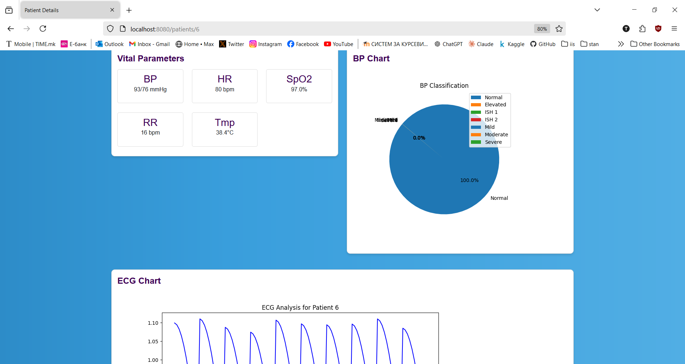
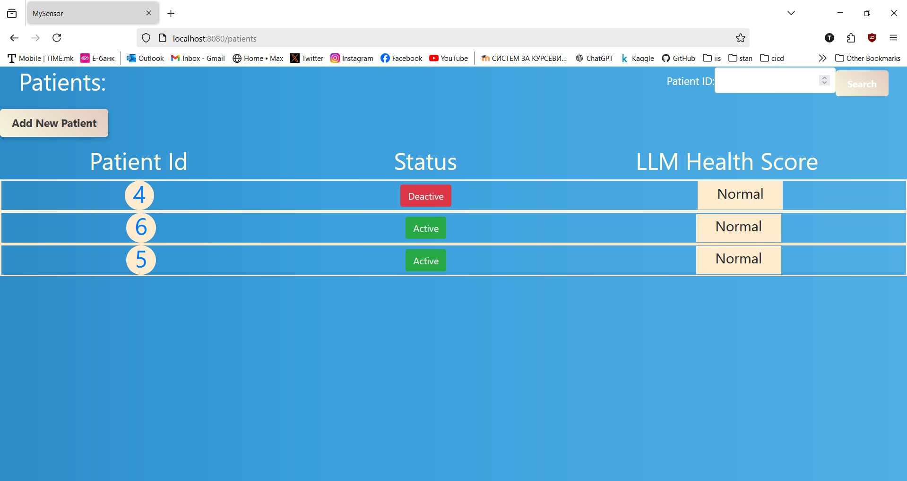

# VitalParametersSystem
## Views

details:

home:

patients:

add:

## setup

set up timescale according to documentation:
https://docs.timescale.com/self-hosted/latest/install/installation-windows/#install-and-configure-timescaledb-on-postgresql
1. install postgresql and timescaledb
2. in cmd: 
psql -d "postgres://\<username>:\<password>@\<host>:\<port>/<database-name>"

Add TimescaleDB to the database
CREATE EXTENSION IF NOT EXISTS timescaledb;

Check that TimescaleDB is installed
\dx

3. you will need to

net stop postgresql-x64-16
 
net start postgresql-x64-16

after adding the extension

4. pip install neurokit2 psycopg2-binary

5. python simulator.py

6. Verify data insertion:
   SELECT * FROM vitals;

7. run python createtables.py to create the tables

8. run python populatepatients.py to populate the patients table

pip install websocket-client

## For visualizations
1. pip install Flask
2. pip install matplotlib
3. pip install flask-cors 
